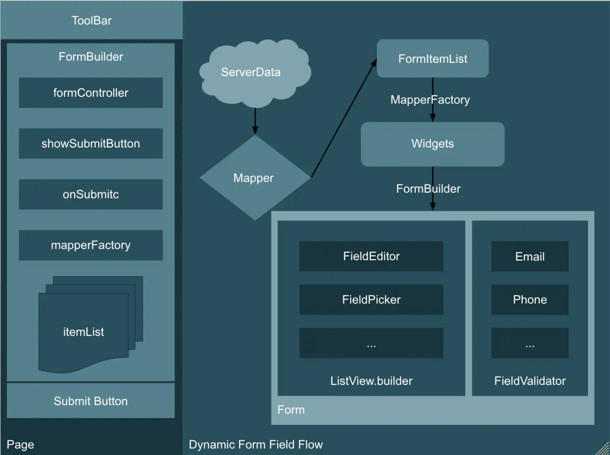
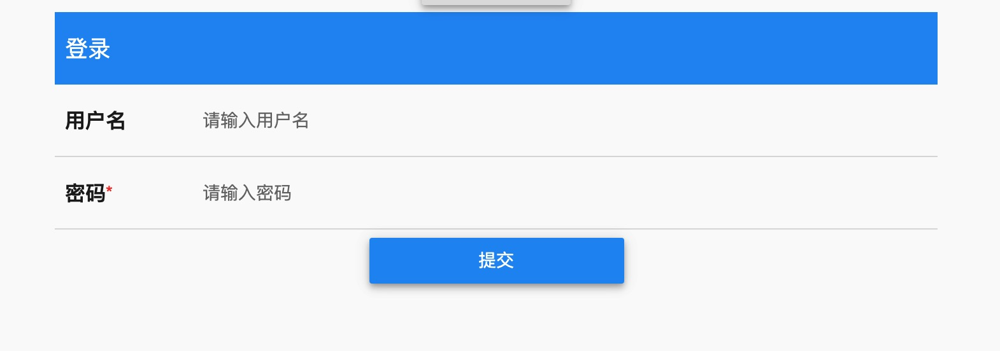
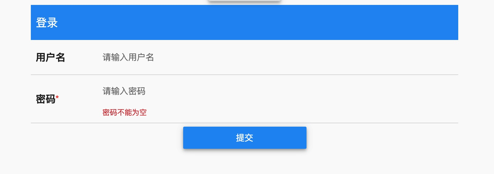
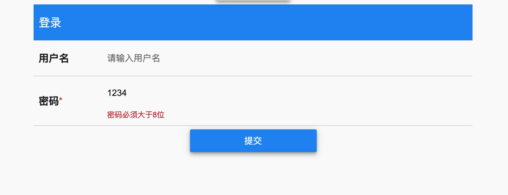

# flutter_dynamic_form
⚡️In the actual business development, there are quite a lot of business scenarios for dynamic forms, especially for ToB business, form submission and verification, not to mention, more and more complex. If there is an appropriate framework to reduce those simple but full of repeated operations, it can also solve those complex operations, why not.作，何乐而不为呢。

It has been written **100% in Dart**. ❤️

# Architecture


- ⚡️The first part shows the position of FormBuilder, the main character of the framework, in the page, and the basic property definition

  **formController** It is an abstraction of unified form management. It can verify the validator, reset all form statuses, save and so on. In the future, it can be expanded according to the needs

  **showSubmitButton** Show the submit button. You can set false to hide it if you have your own submit button

  **onSubmit** The callback callback after data verification returns the data verification result

  **mapperFactory** This is the key to the dynamic expansion of formfield, through which other people can dynamically implement their own formfield to meet special business needs.

  **itemList** This is the current page that maperFactory converts the business data set formitem to the corresponding widget set, and finally displays.

- ⚡️The second part shows the business process of a dynamic form, from sending data from the server to mapping to the corresponding formitemlist, then converting from mapperfactory to the corresponding widget, and finally handing it to FormBuilder, then FormBuilder generates a form, dynamically displaying all the formfields through a listview, and finally doing the final data verification through the abstract implementation of fieldvalidator , this is the general process.
I hope that the two expressions can give you a clear understanding of the whole framework. Next, let's talk about how to expand a formfield so that you can understand the framework from the source.
## Getting Started
Step 1
```
///prepare data
List<FormItem> buildFormItemList() {
  List<FormItem> item = [];
  item.add(FormItem(
    GlobalKey<FormState>(),
    widgetType: WIDGET_TYPE_HEAD,
    label: "登录",
  ));
  item.add(FormItem(GlobalKey<FormState>(),
      widgetType: WIDGET_TYPE_EDIT,
      label: "用户名",
      required: false,
      validators: EmailValidator(errorText: "请输入正确的邮箱"),
      mapKey: "userName",
      extra: {'hintText': '请输入用户名'}));

  final passwordValidator = MultiValidator([
    RequiredValidator(errorText: '密码不能为空'),
    MinLengthValidator(8, errorText: '密码必须大于8位'),
    PatternValidator(r'(?=.*?[#?!@$%^&*-])', errorText: '密码必须至少有一个特殊字符')
  ]);

  item.add(FormItem(GlobalKey<FormState>(),
      widgetType: WIDGET_TYPE_EDIT,
      label: "密码",
      required: true,
      validators: passwordValidator,
      mapKey: "password",
      extra: {'hintText': '请输入密码'}));
  return item;
}

```
Step 2
```
  /// new FormBuilderController
  FormBuilderController _builderController = FormBuilderController();
  /// get data
  List<FormItem> _formList = buildFormItemList();

  /// in your page add this widget
            FormBuilderWidget(
                showSubmitButton: true,
                itemList: _formList,
                formBuilderController: _builderController,
                onSubmit: (bool, data) async {
                  if (bool) print(data.toString());
                },
                mapperFactory: DefaultMapperFactory(null),
              )
```
## Ui and validator result







## Blog 

https://www.jianshu.com/p/42759cd7eba5

## Thanks
[sirily11](https://github.com/sirily11)/**[json-textfrom](https://github.com/sirily11/json-textfrom)**

[codegrue](https://github.com/codegrue)/**[card_settings](https://github.com/codegrue/card_settings)**

[https://medium.com/flutter-community/flutter-how-to-validate-fields-dynamically-created-40cafca5c3cb](https://medium.com/flutter-community/flutter-how-to-validate-fields-dynamically-created-40cafca5c3cb)

[https://stackoverflow.com/questions/55463981/whats-the-best-way-to-dynamically-load-form-fields-in-flutter](https://stackoverflow.com/questions/55463981/whats-the-best-way-to-dynamically-load-form-fields-in-flutter)

[https://book.flutterchina.club/chapter7/inherited_widget.html](https://book.flutterchina.club/chapter7/inherited_widget.html)


### License

   ```
Copyright 2019 Hurshi

Licensed under the Apache License, Version 2.0 (the "License");
you may not use this file except in compliance with the License.
You may obtain a copy of the License at

    http://www.apache.org/licenses/LICENSE-2.0

Unless required by applicable law or agreed to in writing, software
distributed under the License is distributed on an "AS IS" BASIS,
WITHOUT WARRANTIES OR CONDITIONS OF ANY KIND, either express or implied.
See the License for the specific language governing permissions and
limitations under the License.
   ```


